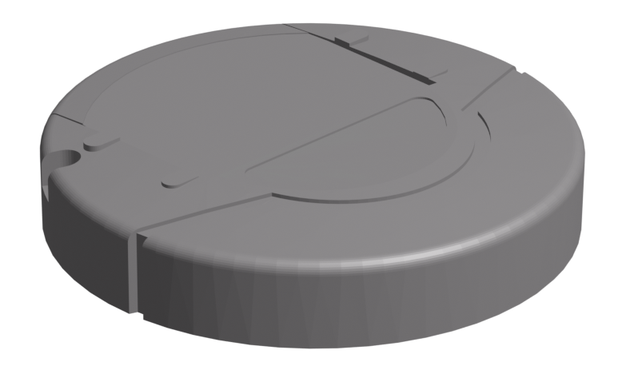

# Prandroide
Learning and generalization on a navigation task of a wheeled robot 

## installation
Run `install-dependencies.sh` to install the necessary libraries:
- gym
- libfastsim
- pybind11
- pyfastsim
- pybullet-gym


## Scenes

| Image | 3D Render | Name |
| --- | --- |--- |
|||`Kitchen-v0`|
|||`Maze_hard-v0`|

Use the function ``svg2obj.py`` to convert an svg image to a 3D object using Blender (Note: change directory in the program)

## Robot


We have modified a model of the iRobot create.
# libfastsim
## Documentation
documentation can be found here : https://github.com/jbmouret/libfastsim
and here for the python binding : https://github.com/alexendy/pyfastsim
## Example
```
python RandomMouv.py
```

# Pybullet

## Installation
You can install ``irobot_gym`` with the following commands:

```shell_script
cd pybullet
pip install -e .
```

## Environments

### Configuration 
each scene is configured in a yml file with its name in the "scenarios" folder like so:
```yml
world:
  name: kitchen
  sdf: kitchen.sdf
  physics:
    gravity: -9.81
  simulation:
    time_step: 0.01
    rendering: True
  goal:
    goal_position: [1,4,0]
    goal_size : 0.2

agents:
  id: A
  vehicle:
    name: iRobot
    sensors: [lidar]
  task:
    task_name: maximize_progress
    params: { time_limit: 120.0, terminate_on_collision: False, goal_size_detection: 0.2}
  starting_position: [2, 1, 0.05]
  starting_orientation: [ 0.0, 0.0, 1]
```
And for the configuration of the robot:
```yml
urdf_file: iRobot.urdf

sensors:
  - type: lidar
    name: lidar
    frequency: 25
    params:
      accuracy: 0.03
      rays: 100 
      range: 15.0
      min_range: 0.05
      angle_start: -0.85
      angle: 1.71  
      debug: True
```      
### Actions


|Key|Space|Description|
|---|---|---|
|motor|`Box(low=-1, high=1, shape=(2,))`|Throttle command for each weel. If negative, the wheel accelerates backwards.|


## Example
```
python simple_usage.py
```
``` python
import gym
from time import sleep
from iRobot_gym.envs import SimpleNavEnv

env = gym.make('Kitchen_Gui-v0')

done = False
obs = env.reset()
t = 0

while not done:
    action = env.action_space.sample()
    obs, rewards, done, states = env.step(action)
    sleep(0.01)
    print("Step  %d reward=%f robot position=%s dist_obj=%f" % (t,rewards,  str(states["pose"][0:3]) ,states["progress"] ) , end="\r" )
    image = env.render()
    t+=1

env.close()
```

