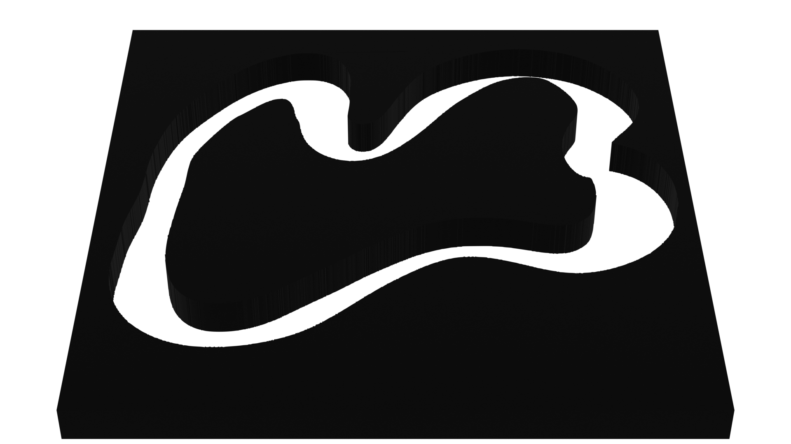

# Prandroide

Learning and generalization on a navigation task of a wheeled robot

## installation

Run `install-dependencies.sh` to install the necessary libraries:

- gym
- libfastsim
- pybind11
- pyfastsim
- pybullet-gym

## Scenes

| Image                                      | 3D Render                                      | Name            |
| ------------------------------------------ | ---------------------------------------------- | --------------- |
|       |       | `Kitchen-v0`    |
|   |   | `Maze_hard-v0`  |
|  |  | `Race_track-v0` |

```console
blender --background --python pbm_to_obj.py
```

in the blender folder to convert all the pbm images to a 3D objects using Blender and Potrace.

## Robot


We have modified a model of the iRobot create.

# libfastsim

## Documentation

documentation can be found here : https://github.com/jbmouret/libfastsim
and here for the python binding : https://github.com/alexendy/pyfastsim

# Pybullet

## Installation

You can install `irobot_gym` with the following commands:

```shell_script
cd pybullet
pip install -e .
```

## Environments

### Configuration

each scene is configured in a yml file with its name in the "scenarios" folder like so:

```yml
world:
  name: race_track
  sdf: race_track.urdf
  scale: 20
  physics:
    gravity: -9.81
  simulation:
    time_step: 0.016666
    GUI: True
    following_camera: False
  goal:
    goal_position: [2, 5, 0]
    goal_size: 0.2

agents:
  id: A
  vehicle:
    name: iRobot
    sensors: [lidar, left_bumper, right_bumper]
  task:
    task_name: maximize_progress
    params: { time_limit: 5, goal_size_detection: 0.2 }
  starting_position: [3, 4, 0]
  starting_orientation: [0.0, 0.0, 0]
```

And for the configuration of the robot:

```yml
urdf_file: /../../models/iRobot/iRobot.urdf

actuators:
  - type: motor
    name: motor
    params:
      velocity_multiplier: 16.5 #0.5m/s
      max_force: 20

sensors:
  - type: lidar
    name: lidar
    frequency: 100
    params:
      accuracy: 0.01
      rays: 10
      range: 4
      min_range: 0
      angle_start: -90 # degree
      angle: 180 #degree
      visible: True

  - type: left_bumper
    name: left_bumper
    frequency: 100
    params:
      accuracy: 0.00
      rays: 1
      range: 0.01
      min_range: 0
      angle_start: 0 # degree
      angle: 0 #degree
      visible: True

  - type: right_bumper
    name: right_bumper
    frequency: 100
    params:
      accuracy: 0.00
      rays: 1
      range: 0.01
      min_range: 0
      angle_start: 0 # degree
      angle: 0 #degree
      visible: True
```
