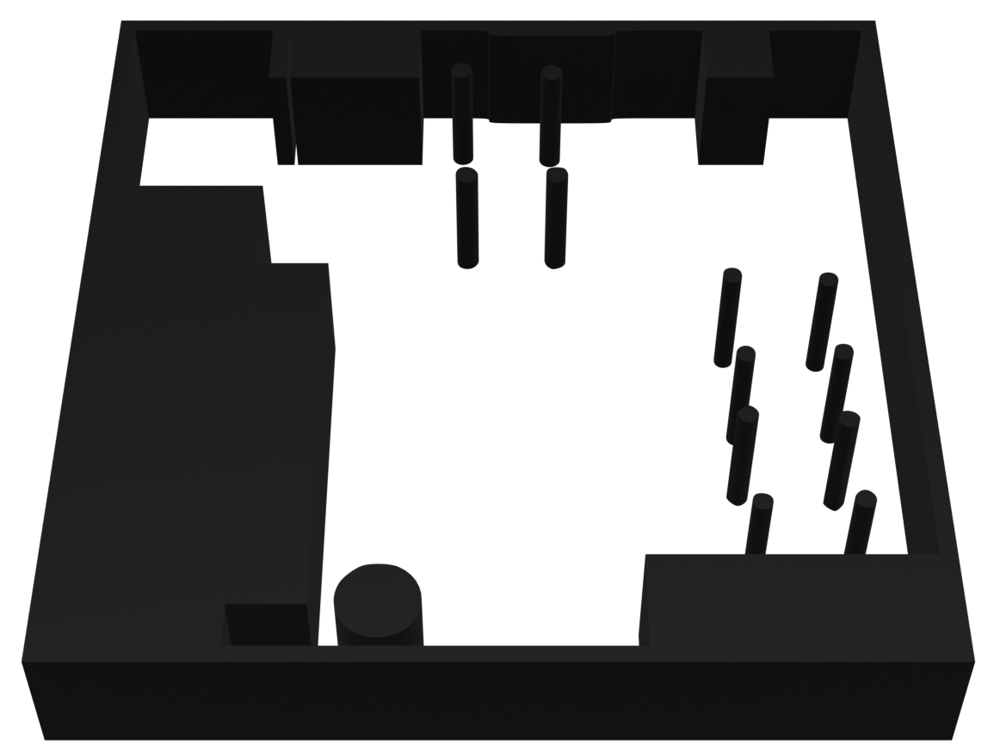
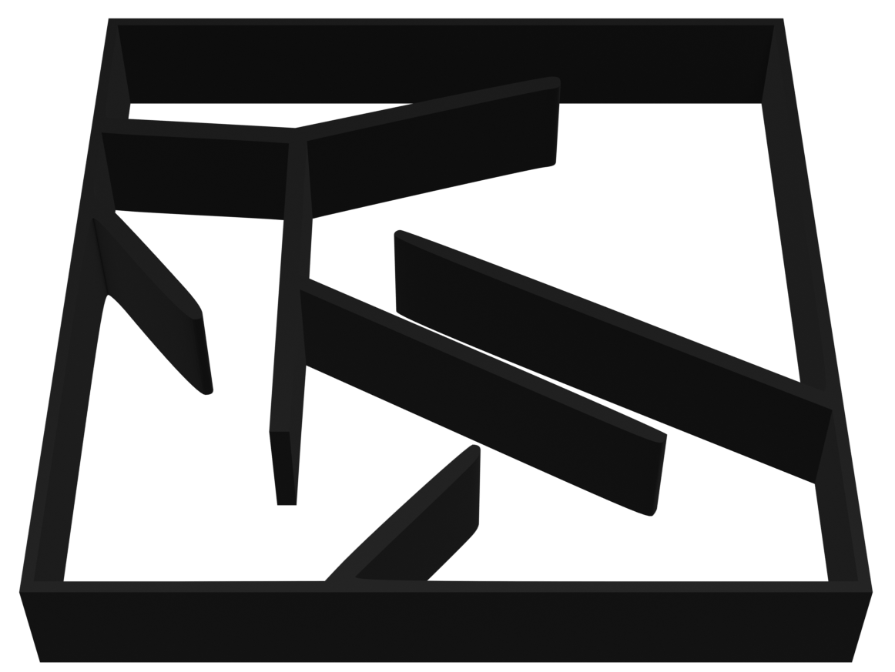
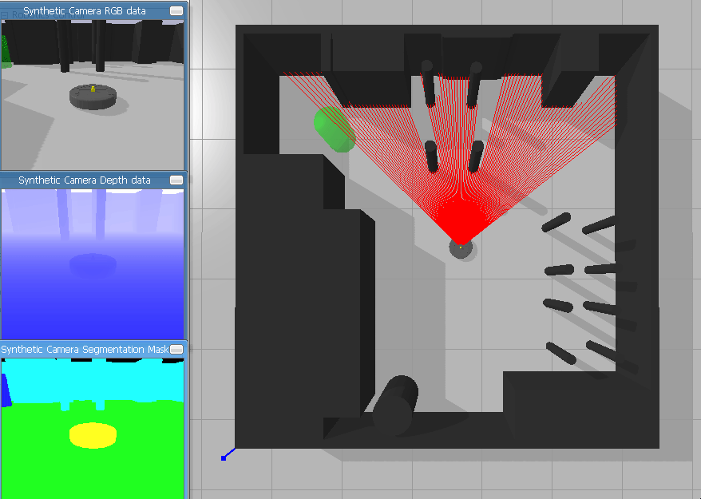

# Prandroide

Learning and generalization on a navigation task of a wheeled robot

## installation

Run `install-dependencies.sh` to install the necessary libraries:

- gym
- libfastsim
- pybind11
- pyfastsim
- pybullet-gym
- deap

boost and dsl 1.2 may be necessary for libfastsim

## Scenes

| Image                                      | 3D Render                                      | Name           |
| ------------------------------------------ | ---------------------------------------------- | -------------- |
|       |       | `kitchen-v0`   |
|   |   | `maze_hard-v0` |
|  |  | `race_track-v0` |

```console
blender --background --python pbm_to_obj.py
```

in the blender folder to convert an pbm image to a 3D object using Blender and Potrace.

## Robot


We have modified a model of the iRobot create.

# libfastsim

## Documentation

documentation can be found here : https://github.com/jbmouret/libfastsim
and here for the python binding : https://github.com/alexendy/pyfastsim


# Pybullet

## Installation

You can install `irobot_gym` with the following commands:

```shell_script
cd pybullet
pip install -e .
```

## Environments

### Configuration

each scene is configured in a yml file with its name in the "scenarios" folder like so:

```yml
world:
  name: race_track
  sdf: race_track.urdf
  scale: 20 #size of the map in meter
  physics:
    gravity: -9.81
  simulation:
    time_step: 0.016666 #240Hz
    GUI: True
    following_camera: False
  goal:
    goal_position: [2, 5, 0] #x,y,z
    goal_size: 0.2 #diameter of the cylinder

agents:
  id: A
  vehicle:
    name: iRobot
    sensors: [laser]
  task:
    task_name: maximize_progress #type of reward function
    params: { time_limit: 1000.0, goal_size_detection: 0.2 }
  starting_position: [3, 4, 0] #x,y,z
  starting_orientation: [0, 0, 0] #roll,pitch yaw
```

And for the configuration of the robot:

```yml
urdf_file: iRobot.urdf

actuators:
  - type: motor
    name: motor
    params:
      velocity_multiplier: 16.5 # 0.5m/s
      max_force: 20

sensors:
  - type: lidar
    name: lidar
    frequency: 100
    params:
      inaccuracy: 0.00
      rays: 10 # number of lasers
      range: 1 # range in meter
      min_range: 0 # laser start offset
      angle_start: -90 # degree
      angle: 180
      debug: True # visible laser of not
```
## Run
In the `pybullet` and `Simulationfastsim` folder we have a `main.py` file used to run each simulations.


